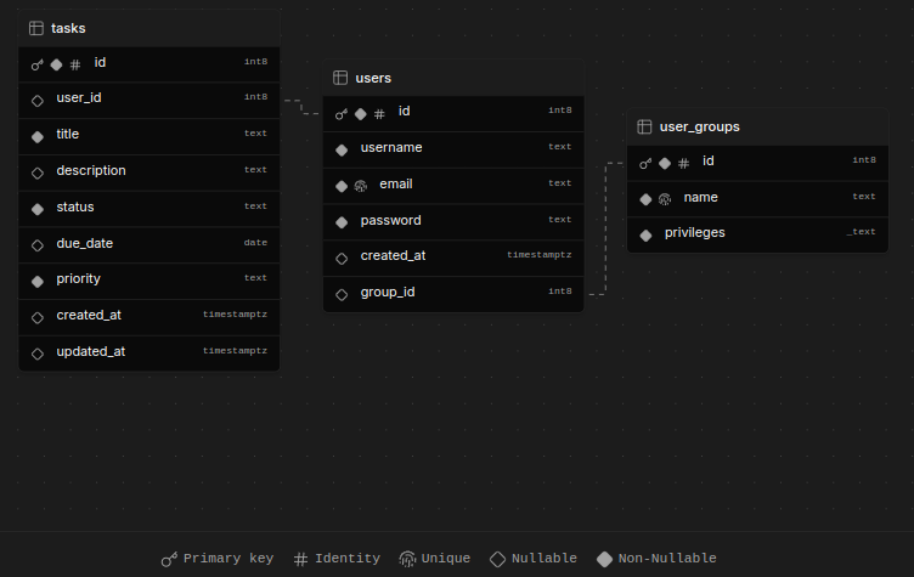

COMANDOS:
```sql
sudo -u postgres psql
CREATE DATABASE usuariosdb;
CREATE USER usuarioapp WITH PASSWORD 'passwordsegura123';
GRANT ALL PRIVILEGES ON DATABASE usuariosdb TO usuarioapp;

psql -h localhost -p 5432 -U usuarioapp -d usuariosdb -f src/main/resources/db/migration/V1__initial_schema.sql
passwordsegura123
```

